## 🧠 `Ahammad.init(Data_Science)`

## 🧠 Neural Network of Knowledge

```mermaid
%%{init: {'theme': 'dark', 'themeVariables': { 'nodeBorder': '#333', 'mainBkg': '#1a1a1a'}}}%%
graph TD
    A[Python] -->|Input Layer| B(Data Science)
    B -->|Hidden Layer 1| C(Machine Learning)
    B -->|Hidden Layer 1| D(Data Visualization)
    C -->|Hidden Layer 2| E(Deep Learning)
    D -->|Hidden Layer 2| F(Statistical Analysis)
    E -->|Output Layer| G{AI}
    F -->|Output Layer| G
    G -->|Feedback Loop| A
    style A fill:#3572A5,stroke:#fff,stroke-width:2px
    style B fill:#FFA726,stroke:#fff,stroke-width:2px
    style C fill:#66BB6A,stroke:#fff,stroke-width:2px
    style D fill:#AB47BC,stroke:#fff,stroke-width:2px
    style E fill:#EF5350,stroke:#fff,stroke-width:2px
    style F fill:#29B6F6,stroke:#fff,stroke-width:2px
    style G fill:#FF7043,stroke:#fff,stroke-width:4px
    classDef default fill:#1a1a1a,stroke:#fff,stroke-width:2px;
```

## 💻 Tech Stack

## 🌟 Projects

| Project Codename | Description |
|-------------------|-------------|
| `Predicta` | Data Analysis and ML Tool |
| `Rokomari Book Store Analysis` | Analyzed Batighor Publication Store |
| `Synapto` | AI-Powered Note-Taking App |
| `Oratio` | Voice and Vision Assistant |

## 📈 GitHub Stats

[]

## 🌐 Connect
)

